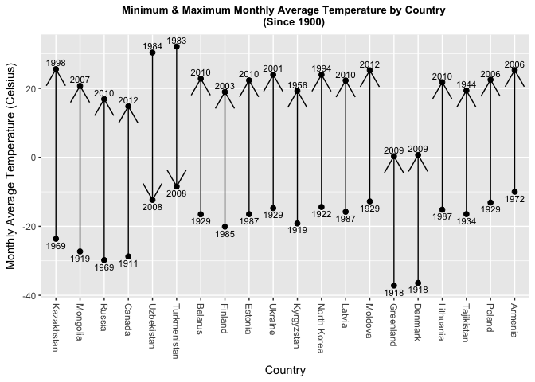
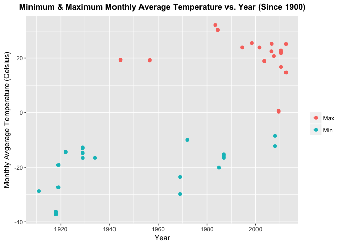
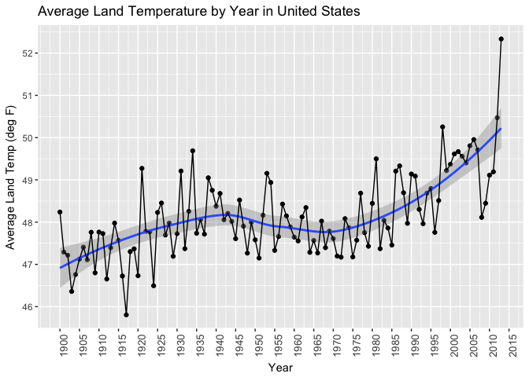
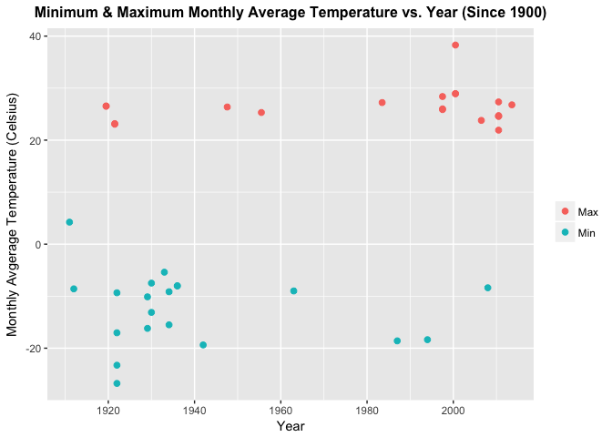

Orange Trees and Land Temperature Data
================
Georges Michel, Jack Nelson, Nicole Shaver, Nathan Tuttle
April 13, 2017

### Introduction

In this study....

    ##  Tree       age         circumference  
    ##  3:7   Min.   : 118.0   Min.   : 30.0  
    ##  1:7   1st Qu.: 484.0   1st Qu.: 65.5  
    ##  5:7   Median :1004.0   Median :115.0  
    ##  2:7   Mean   : 922.1   Mean   :115.9  
    ##  4:7   3rd Qu.:1372.0   3rd Qu.:161.5  
    ##        Max.   :1582.0   Max.   :214.0

``` r
Orange_Mean
```

    ## [1] 115.8571

``` r
Orange_Median
```

    ## [1] 115

Including Plots
---------------

You can also embed plots, for example:

 \#\#\#\# Code used to download and tidy data

``` r
dir<-getwd()
#download the TEMP temp file and assign it to dataset name Temp_clean
source(paste(dir,"/source/download_2.R",sep=""))
#cleanup the data-turn the dates from strings to dates
source(paste(dir,"/source/cleanup_2.R",sep=""))
source(paste(dir,"/source/CityTemp_cleanup.R",sep=""))
```

### 3i. Find the difference between the maximum and the minimum monthly average temperatures for each country and report/visualize top 20 countries with the maximum differences for the period since 1900.

#### The following code chunk takes the Temp\_clean data frame and returns T20MinMaxTemp, the top 20 countries with the greatest temperature difference between their minimum and maximum Monthly.AvgTemp observations since 1/1/1900.

##### The variables contained in T20MinMaxTemp are as follows:

-   Country
-   Min.Monthly.AvgTemp
-   Min.Date
-   Max.Monthly.AvgTemp
-   Max.Date
-   TempDiff

##### The steps taken to obtain T20MinMaxTemp are as follows:

-   Subset Temp\_clean to take only observations since 1/1/1900
-   Aggregate Temp\_clean1900 to receive minimum Monthly.AverageTemp
-   Merge the minimum Monthly.AverageTemp value back with its Temp\_clean1900 observation
-   Repeat the previous two steps for maximum Monthly.AverageTemp
-   Merge minimum and maximum subsets into single data frame
-   Take only needed vectors for T20MinMaxTemp and rename vectors
-   Calculate TempDiff
-   Reorder data frame in descending order by TempDiff
-   Subset to take only first 20 observations

``` r
# taking observations since 1900
Temp_clean1900 <- Temp_clean[which(Temp_clean$Date >= "1900-01-01"), ]

# arrgregate to receive min Monthly.AverageTemp by Country
Temp.agg.min <- aggregate(Monthly.AverageTemp ~ Country, Temp_clean1900, min)
# merge back with original Temp.agg.min dataframe to receive date of min observation
Temp.agg.min2 <- merge(Temp.agg.min, Temp_clean1900, by = c('Country', 'Monthly.AverageTemp'))

# arrgregate to receive max Monthly.AverageTemp by Country
Temp.agg.max <- aggregate(Monthly.AverageTemp ~ Country, Temp_clean1900, max)
# merge back with original Temp.agg.max dataframe to receive date of max observation
Temp.agg.max2 <- merge(Temp.agg.max, Temp_clean1900, by = c('Country', 'Monthly.AverageTemp'))

# merge both Temp.agg.min2 and Temp.agg.max2 together
MinMaxTemp <- merge(Temp.agg.min2, Temp.agg.max2, by = 'Country')

# remove unneeded variables and rename remaining variables in MinMaxTemp
MinMaxTemp <- MinMaxTemp[, c(1,2,4,5,7)]
names(MinMaxTemp) <- c('Country','Min.Monthly.AvgTemp','Min.Date', 'Max.Monthly.AvgTemp', 'Max.Date')

# generate difference between the max and min Monthly.AvgTemp for each observation
MinMaxTemp$TempDiff <- MinMaxTemp$Max.Monthly.AvgTemp - MinMaxTemp$Min.Monthly.AvgTemp

# order dataframe in descending order by TempDiff
MinMaxTemp <- MinMaxTemp[order(-MinMaxTemp$TempDiff), ]

# take the top 20 countries with the highest TempDiff
T20MinMaxTemp <- MinMaxTemp[1:20, ]
```

#### The following code chunk takes the T20MinMaxTemp data frame and returns T20MinMaxTempLong, the long format of T20MinMaxTemp needed for plotting.

##### The variables contained in T20MinMaxTempLong are as follows:

-   Country
-   Date
-   TempDiff
-   Min.Max
-   Monthly.AvgTemp

##### The steps taken to obtain T20MinMaxTempLong are as follows:

-   Converting Monthly.AvgTemp into long format for only minimum values
-   Taking only the first 3 characters needed for the Min.Max indicator variable
-   Repeat the previous two steps for maximum Monthly.AvgTemp values
-   Renaming Min.Date and Max.Date in subsets to a common variable name Date
-   Unioning both subsets together to get one long formatted data frame
-   Reorder T20MinMaxTempLong to group values by Country ranked by Date
-   Transform Country order to be ranked by TempDiff for plotting

``` r
# putting minimum metrics in long format from T20MinMaxTemp
T20MinMaxTemp1 <- melt(T20MinMaxTemp[, c(1:3,6)], id = c("Country","Min.Date", "TempDiff"), variable.name = "Min.Max", value.name = 'Monthly.AvgTemp')
# taking only first 3 character to indicate min observation
T20MinMaxTemp1$Min.Max <- substr(T20MinMaxTemp1$Min.Max, 0, 3)

# putting maximum metrics in long format from T20MinMaxTemp
T20MinMaxTemp2 <- melt(T20MinMaxTemp[, c(1,4,5,6)], id = c("Country","Max.Date", "TempDiff"), variable.name = "Min.Max", value.name = 'Monthly.AvgTemp')
# taking only first 3 characters to indicate max observation
T20MinMaxTemp2$Min.Max <- substr(T20MinMaxTemp2$Min.Max, 0, 3)

# renaming date variable in both subsets to match eachother
names(T20MinMaxTemp1)[names(T20MinMaxTemp1) == 'Min.Date'] <- 'Date'
names(T20MinMaxTemp2)[names(T20MinMaxTemp2) == 'Max.Date'] <- 'Date'

# union 2 subsets together for one long formatted T20MinMaxTemp dataframe
T20MinMaxTempLong <- union(T20MinMaxTemp1, T20MinMaxTemp2)

# reorder to group by Country and put two dates in order for plotting
T20MinMaxTempLong <- T20MinMaxTempLong[order(T20MinMaxTempLong$TempDiff,T20MinMaxTempLong$Date), ]

# reorder Country in descending order according to TempDiff
T20MinMaxTempLong <- transform(T20MinMaxTempLong, Country=reorder(Country, -TempDiff) )
```

#### The following code chunk plots the T20MinMaxTemp data frame with Country in the x axis ranked by TempDiff and Monthly.AvgTemp in the y axis. The Min and Max values are plotting with labels indicating the year the observation occurred. An arrow then indicates which observation occurred first (Min prior to Max = Up; Max prior to Min = Down)

``` r
ggplot(T20MinMaxTempLong, aes(x=Country, y=Monthly.AvgTemp, 
    group=Country, factor(TempDiff))) + 
  geom_point(size=2)+geom_path(arrow=arrow()) +
  labs(y = 'Monthly Average Temperature (Celcius)',
      title = 'Minimum & Maximum Monthly Average Temperature by Country 
      (Since 1900)') +
  theme(axis.text.x = element_text(angle = -90, hjust = 0, vjust = 0.5),
        plot.title = element_text(size=10, face='bold', hjust=0.5)) + 
  geom_text(data = filter_(T20MinMaxTempLong, ~Min.Max == 'Min'), 
            aes(label=format(Date,'%Y'), hjust=0.5, vjust=1.5), size = 3) +
  geom_text(data = filter_(T20MinMaxTempLong, ~Min.Max == 'Max'), 
            aes(label=format(Date,'%Y'), hjust=0.5, vjust=-0.5), size =3)
```



#### The following code chunk plots the T20MinMaxTemp data frame with Year in the x axis and Monthly.AvgTemp in the y axis. The Min and Max Monthly.AvgTemp values are plotted by color.

``` r
ggplot(T20MinMaxTempLong, aes(x=Date, y=Monthly.AvgTemp, color=Min.Max)) + 
  geom_point(size=2) +
  labs(x = 'Year', y = 'Monthly Avgerage Temperature (Celcius)', 
      title = 'Minimum & Maximum Monthly Average Temperature vs. Year (Since 1900)',
      color = "") +
  theme(plot.title = element_text(size=12, face='bold', hjust=0.5))
```



### Q3ii.a. Select a subset of data called “UStemp” where US land temperatures from 01/01/1990 in Temp data. Use UStemp dataset to answer the followings. Create a new column to display the monthly average land temperatures in Fahrenheit (°F).

#### Using the data from 1900 to 2013 for average land temperatures only in the United States, we can convert the temperatures from degrees C to degrees F using the formula Temp (deg F) = Temp (deg C)\* 1.8 +32.

``` r
#The following code chunk will keep only the data since 1900, subset only the data from the United States, rename the temperature column in the existing dataset to be explicitly in degrees C. It will then add a column with the temperature data converted to degrees C and display the first few rows of the resulting table.


UStemp<-Temp_clean1900[grep("United States", Temp_clean1900$Country), ]
UStemp<-dplyr::rename(UStemp, Monthly.AverageTemp.degC=Monthly.AverageTemp)
UStemp$Monthly.AverageTemp.degF<-(UStemp$Monthly.AverageTemp.degC*1.8)+32
head(UStemp)
```

    ##        Monthly.AverageTemp.degC Monthly.AverageTemp.Uncertainty
    ## 110207                   -1.702                           0.206
    ## 113557                    8.534                           0.103
    ## 116909                    9.848                           0.201
    ## 117050                   -2.286                           0.154
    ## 117915                   21.690                           0.110
    ## 118266                    2.504                           0.186
    ##              Country       Date Monthly.AverageTemp.degF
    ## 110207 United States 1934-12-01                  28.9364
    ## 113557 United States 2009-10-01                  47.3612
    ## 116909 United States 1933-10-01                  49.7264
    ## 117050 United States 1972-02-01                  27.8852
    ## 117915 United States 2008-07-01                  71.0420
    ## 118266 United States 1986-11-01                  36.5072

### Q3ii.b. Calculate average land temperature by year and plot it. The original file has the average land temperature by month.

#### Calculating the average land temperature by Year and plotting it, we see a general trend up in average land temperatures in the United States between 1900 and 2013.

``` r
#The following code chunk will take the year portion of each month, summarize the temperature data in degrees F by year, and then plot the Temperature data by year.

UStemp$Year<-as.POSIXlt(UStemp$Date)$year+1900
UStempYear<-ddply(UStemp,~Year,summarise,Temp.mean.degF=mean(Monthly.AverageTemp.degF))
ggplot(UStempYear, aes(x = Year, y=Temp.mean.degF))+geom_point()+geom_smooth()+labs(y="Average Land Temp (deg F)")+labs(title = "Average Land Temperature by Year in United States")+geom_line()+scale_x_continuous(breaks=seq(1900,2015,5))+theme(axis.text.x = element_text(size=10, angle=90))+scale_y_continuous(breaks=seq(40,56,1))
```

    ## `geom_smooth()` using method = 'loess'



### Q3ii.c. Calculate the one year difference of average land temperature by year and provide the maximum difference (value) with corresponding two years.

#### Calculating the one year difference of average land temperature by year, we find that the maximum absolute temperature difference is 2.5401 degrees F, and occurred between 1920 and 1921.

``` r
#The code chunk below will first sort the data, by year, in ascending order. Then, it will calculate the 1 year deltas (ie 1991-1990,1992-1991), take the absolute value, and then report the max value and the years and the corresponding 2 years.


UStempYear_sorta<-arrange(UStempYear,Year)
UStempYear_sorta$UStempYear.delta.degF <- abs(UStempYear_sorta$Temp.mean.degF -lag(UStempYear_sorta$Temp.mean.degF))
UStempYear_sorta$Year_lab<-paste(lag(UStempYear_sorta$Year),"-",UStempYear_sorta$Year)
UStempYear_sorta[which(UStempYear_sorta$UStempYear.delta == max(UStempYear_sorta$UStempYear.delta, na.rm=TRUE)), ]
```

    ##    Year Temp.mean.degF UStempYear.delta.degF    Year_lab
    ## 22 1921        49.2722                2.5401 1920 - 1921

### 3iii. Download “CityTemp” data set at box.com. Find the difference between the maximum and the minimum temperatures for each major city and report/visualize top 20 cities with maximum differences for the period since 1900.

#### The following code chunk takes the CityTemp\_clean data frame and returns T20MinMaxCityTemp, the top 20 cities with the greatest temperature difference between their minimum and maximum Monthly.AvgTemp observations since 1/1/1900.

##### The variables contained in T20MinMaxCityTemp are as follows:

-   City
-   Min.Monthly.AvgTemp
-   Country
-   Latitude
-   Min.Date
-   Max.Monthly.AvgTemp
-   Max.Date
-   TempDiff

##### The steps taken to obtain T20MinMaxCityTemp are as follows:

-   Subset CityTemp\_clean to take only observations since 1/1/1900
-   Aggregate CityTemp\_clean1900 to receive minimum Monthly.AverageTemp
-   Merge the minimum Monthly.AverageTemp value back with its CityTemp\_clean1900 observation
-   Repeat the previous two steps for maximum Monthly.AverageTemp
-   Merge minimum and maximum subsets into single data frame
-   Take only needed vectors for T20MinMaxCityTemp and rename vectors
-   Calculate TempDiff
-   Reorder data frame in descending order by TempDiff
-   Subset to take only first 20 observations

``` r
# taking observations since 1900
CityTemp_clean1900 <- CityTemp_clean[which(CityTemp_clean$Date >= "1900-01-01"), ]

# arrgregate to receive min Monthly.AverageTemp by City
CityTemp.agg.min <- aggregate(Monthly.AverageTemp ~ City, CityTemp_clean1900, min)
# merge back with original CityTemp.agg.min dataframe to receive date of min observation
CityTemp.agg.min2 <- merge(CityTemp.agg.min, CityTemp_clean1900, by = c('City', 'Monthly.AverageTemp'))

# arrgregate to receive max Monthly.AverageTemp by City
CityTemp.agg.max <- aggregate(Monthly.AverageTemp ~ City, CityTemp_clean1900, max)
# merge back with original Temp.agg.max dataframe to receive date of max observation
CityTemp.agg.max2 <- merge(CityTemp.agg.max, CityTemp_clean1900, by = c('City', 'Monthly.AverageTemp'))

# merge both Temp.agg.min2 and Temp.agg.max2 together
MinMaxCityTemp <- merge(CityTemp.agg.min2, CityTemp.agg.max2, by = 'City')

# remove unneeded variables and rename remaining variables in MinMaxTemp
MinMaxCityTemp <- MinMaxCityTemp[, c(1,2,4,5,7,8,13)]
names(MinMaxCityTemp) <- c('City', 'Min.Monthly.AvgTemp', 'Country', 'Latitude', 
                       'Min.Date', 'Max.Monthly.AvgTemp', 'Max.Date')

# generate difference between the max and min Monthly.AvgTemp for each observation
MinMaxCityTemp$TempDiff <- MinMaxCityTemp$Max.Monthly.AvgTemp - MinMaxCityTemp$Min.Monthly.AvgTemp

# order dataframe in descending order by TempDiff
MinMaxCityTemp <- MinMaxCityTemp[order(-MinMaxCityTemp$TempDiff), ]

# take the top 20 countries with the highest TempDiff
T20MinMaxCityTemp <- MinMaxCityTemp[1:20, ]
```

#### The following code chunk takes the T20MinMaxCityTemp data frame and returns T20MinMaxCityTempLong, the long format of T20MinMaxCityTemp needed for plotting.

##### The variables contained in T20MinMaxCityTempLong are as follows:

-   City
-   Country
-   Latitude
-   Date
-   TempDiff
-   Min.Max
-   Monthly.AvgTemp

##### The steps taken to obtain T20MinMaxCityTempLong are as follows:

-   Converting Monthly.AvgTemp into long format for only minimum values
-   Taking only the first 3 characters needed for the Min.Max indicator variable
-   Repeat the previous two steps for maximum Monthly.AvgTemp values
-   Renaming Min.Date and Max.Date in subsets to a common variable name Date
-   Unioning both subsets together to get one long formatted data frame
-   Reorder T20MinMaxCityTempLong to group values by City ranked by Date
-   Transform City order to be ranked by TempDiff for plotting

``` r
# putting minimum metrics in long format from T20MinMaxCityTemp
T20MinMaxCityTemp1 <- melt(T20MinMaxCityTemp[, c(1:5,8)], id = 
                           c("City", "Country", "Latitude", "Min.Date", "TempDiff"), 
                           variable.name = "Min.Max", value.name = 'Monthly.AvgTemp')
# taking only first 3 character to indicate min observation
T20MinMaxCityTemp1$Min.Max <- substr(T20MinMaxCityTemp1$Min.Max, 0, 3)

# putting maximum metrics in long format from T20MinMaxCityTemp
T20MinMaxCityTemp2 <- melt(T20MinMaxCityTemp[, c(1,3,4,6:8)], id = 
                           c("City", "Country", "Latitude", "Max.Date", "TempDiff"), 
                           variable.name = "Min.Max", value.name = 'Monthly.AvgTemp')
# taking only first 3 characters to indicate max observation
T20MinMaxCityTemp2$Min.Max <- substr(T20MinMaxCityTemp2$Min.Max, 0, 3)

# renaming date variable in both subsets to match eachother
names(T20MinMaxCityTemp1)[names(T20MinMaxCityTemp1) == 'Min.Date'] <- 'Date'
names(T20MinMaxCityTemp2)[names(T20MinMaxCityTemp2) == 'Max.Date'] <- 'Date'

# union 2 subsets together for one long formatted T20MinMaxCityTemp dataframe
T20MinMaxCityTempLong <- union(T20MinMaxCityTemp1, T20MinMaxCityTemp2)

# reorder to group by City and put two dates in order for plotting
T20MinMaxCityTempLong <- T20MinMaxCityTempLong[order(-T20MinMaxCityTempLong$TempDiff,
                                               T20MinMaxCityTempLong$Date), ]

# reorder City in descending order according to TempDiff
T20MinMaxCityTempLong <- transform(T20MinMaxCityTempLong, City=reorder(City, -TempDiff) )
```

#### The following code chunk plots the T20MinMaxCityTemp data frame with City in the x axis ranked by TempDiff and Monthly.AvgTemp in the y axis. The Min and Max values are plotting with labels indicating the year the observation occurred. An arrow then indicates which observation occurred first (Min prior to Max = Up; Max prior to Min = Down)

``` r
ggplot(T20MinMaxCityTempLong, aes(x=City, y=Monthly.AvgTemp, 
                               group=City, factor(TempDiff))) + 
  geom_point(size=2)+geom_path(arrow=arrow()) +
  labs(y = 'Monthly Average Temperature (Celcius)',
       title = 'Minimum & Maximum Monthly Average Temperature by City (Since 1900)') +
  theme(axis.text.x = element_text(angle = -90, hjust = 0, vjust = 0.5),
        plot.title = element_text(size=10, face='bold', hjust=0.5)) + 
  geom_text(data = filter_(T20MinMaxCityTempLong, ~Min.Max == 'Min'), 
            aes(label=format(Date,'%Y'), hjust=0.5, vjust=1.5), size = 3) +
  geom_text(data = filter_(T20MinMaxCityTempLong, ~Min.Max == 'Max'), 
            aes(label=format(Date,'%Y'), hjust=0.5, vjust=-0.5), size =3)
```


#### The following code chunk plots the T20MinMaxCityTemp data frame with Year in the x axis and Monthly.AvgTemp in the y axis. The Min and Max Monthly.AvgTemp values are plotted by color.

``` r
ggplot(T20MinMaxCityTempLong, aes(x=Date, y=Monthly.AvgTemp, color=Min.Max)) + 
  geom_point(size=2) +
  labs(x = 'Year', y = 'Monthly Avgerage Temperature (Celcius)', 
       title = 'Minimum & Maximum Monthly Average Temperature vs. Year (Since 1900)',
       color = "") +
  theme(plot.title = element_text(size=12, face='bold', hjust=0.5))
```



### 3iv. Compare the two graphs in (i) and (iii) and comment it.

#### The initial plots with arrows indicating if the minimum or maximum Monthly.AvgTemp occurred first shows commonalities between the top 20 countries and 20 cities with the highest TempDiff since 1/1/1900. 18 out of 20 countries and 15 out of 20 cities have their maximum Monthly.AvgTemp occurring later than the minimum Monthly.AvgTemp. The scatter plot showing minimum and maximum Monthly.AvgTemp by year is even more telling. There is appears to be a grouping for maximum values between 1980-present (18 out of 20 countries, 16 out of 20 cities). Without the use of advanced statistics and only using the visual graphics, it appears Monthly.AvgTemp for the top 20 countries and cities with the highest TempDiff since 1/1/1900 has been rising in the last 40 years.
