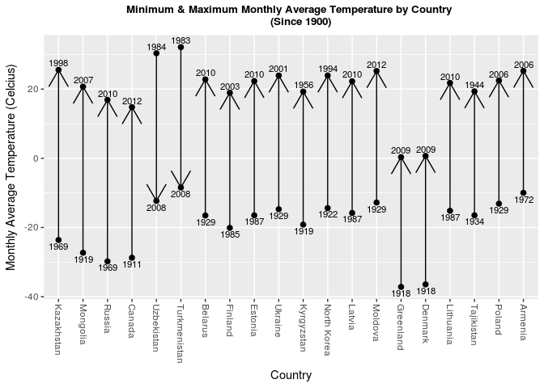
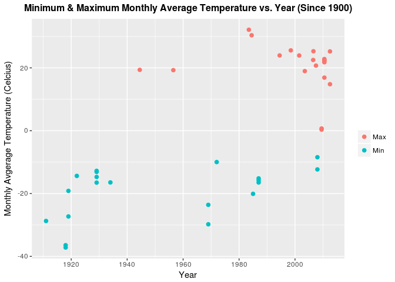

Orange Trees and Land Temperature Data
================
Georges Michel, Jack Nelson, Nicole Shaver, Nathan Tuttle
April 13, 2017

Code used to download, tidy and merge the data
----------------------------------------------

``` r
dir<-getwd()
#download the TEMP temp file and assign it to dataset name Temp_clean
source(paste(dir,"/source/download_2.R",sep=""))
#cleanup the data-turn the dates from strings to dates
source(paste(dir,"/source/cleanup_2.R",sep=""))
```

reformatting to generate top 20 temp diff between min and max (include more detail later)
-----------------------------------------------------------------------------------------

``` r
# taking observations since 1900
Temp_clean1900 <- Temp_clean[which(Temp_clean$Date >= "1900-01-01"), ]

# arrgregate to receive min Monthly.AverageTemp by Country
Temp.agg.min <- aggregate(Monthly.AverageTemp ~ Country, Temp_clean1900, min)
# merge back with original Temp.agg.min dataframe to receive date of min observation
Temp.agg.min2 <- merge(Temp.agg.min, Temp_clean1900, by = c('Country', 'Monthly.AverageTemp'))

# arrgregate to receive max Monthly.AverageTemp by Country
Temp.agg.max <- aggregate(Monthly.AverageTemp ~ Country, Temp_clean1900, max)
# merge back with original Temp.agg.max dataframe to receive date of max observation
Temp.agg.max2 <- merge(Temp.agg.max, Temp_clean1900, by = c('Country', 'Monthly.AverageTemp'))

# merge both Temp.agg.min2 and Temp.agg.max2 together
MinMaxTemp <- merge(Temp.agg.min2, Temp.agg.max2, by = 'Country')

# remove unneeded variables and rename remaining variables in MinMaxTemp
MinMaxTemp <- MinMaxTemp[, c(1,2,4,5,7)]
names(MinMaxTemp) <- c('Country','Min.Monthly.AvgTemp','Min.Date', 'Max.Monthly.AvgTemp', 'Max.Date')

# generate difference between the max and min Monthly.AvgTemp for each observation
MinMaxTemp$TempDiff <- MinMaxTemp$Max.Monthly.AvgTemp - MinMaxTemp$Min.Monthly.AvgTemp

# order dataframe in descending order by TempDiff
MinMaxTemp <- MinMaxTemp[order(-MinMaxTemp$TempDiff), ]

# take the top 20 countries with the highest TempDiff
T20MinMaxTemp <- MinMaxTemp[1:20, ]
```

reformatting to put top 20 data frame in long format (include more detail later)
--------------------------------------------------------------------------------

``` r
# putting minimum metrics in long format from T20MinMaxTemp
T20MinMaxTemp1 <- melt(T20MinMaxTemp[, c(1:3,6)], id = c("Country","Min.Date", "TempDiff"), variable.name = "Min.Max", value.name = 'Monthly.AvgTemp')
# taking only first 3 character to indicate min observation
T20MinMaxTemp1$Min.Max <- substr(T20MinMaxTemp1$Min.Max, 0, 3)

# putting maximum metrics in long format from T20MinMaxTemp
T20MinMaxTemp2 <- melt(T20MinMaxTemp[, c(1,4,5,6)], id = c("Country","Max.Date", "TempDiff"), variable.name = "Min.Max", value.name = 'Monthly.AvgTemp')
# taking only first 3 characters to indicate max observation
T20MinMaxTemp2$Min.Max <- substr(T20MinMaxTemp2$Min.Max, 0, 3)

# renaming date variable in both subsets to match eachother
names(T20MinMaxTemp1)[names(T20MinMaxTemp1) == 'Min.Date'] <- 'Date'
names(T20MinMaxTemp2)[names(T20MinMaxTemp2) == 'Max.Date'] <- 'Date'

# union 2 subsets together for one long formatted T20MinMaxTemp dataframe
T20MinMaxTempLong <- union(T20MinMaxTemp1, T20MinMaxTemp2)

# reorder to group by Country and put two dates in order for plotting
T20MinMaxTempLong <- T20MinMaxTempLong[order(T20MinMaxTempLong$TempDiff,T20MinMaxTempLong$Date), ]

# reorder Country in descending order according to TempDiff
T20MinMaxTempLong <- transform(T20MinMaxTempLong, Country=reorder(Country, -TempDiff) )
```

plotting minmax points on chart by country, labeling points with year, ranking x axis by TempDiff, and arrow indicating if Min/Max occurred first
-------------------------------------------------------------------------------------------------------------------------------------------------

``` r
# plotting T20MinMaxTempLong
ggplot(T20MinMaxTempLong, aes(x=Country, y=Monthly.AvgTemp, 
    group=Country, factor(TempDiff))) + 
  geom_point(size=2)+geom_path(arrow=arrow()) +
  labs(y = 'Monthly Average Temperature (Celcius)',
      title = 'Minimum & Maximum Monthly Average Temperature by Country 
      (Since 1900)') +
  theme(axis.text.x = element_text(angle = -90, hjust = 0, vjust = 0.5),
        plot.title = element_text(size=10, face='bold', hjust=0.5)) + 
  geom_text(data = filter_(T20MinMaxTempLong, ~Min.Max == 'Min'), 
            aes(label=format(Date,'%Y'), hjust=0.5, vjust=1.5), size = 3) +
  geom_text(data = filter_(T20MinMaxTempLong, ~Min.Max == 'Max'), 
            aes(label=format(Date,'%Y'), hjust=0.5, vjust=-0.5), size =3)
```



scatter plot with year in x axis to show time gaps between minmax
-----------------------------------------------------------------

``` r
ggplot(T20MinMaxTempLong, aes(x=Date, y=Monthly.AvgTemp, color=Min.Max)) + 
  geom_point(size=2) +
  labs(x = 'Year', y = 'Monthly Avgerage Temperature (Celcius)', 
      title = 'Minimum & Maximum Monthly Average Temperature vs. Year (Since 1900)',
      color = "") +
  theme(plot.title = element_text(size=12, face='bold', hjust=0.5))
```


